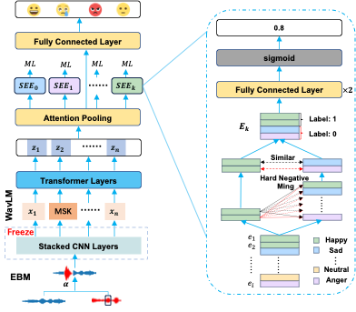

# SeeNet: Soft Emotion Expert with Pretrained model and Data Augmentation Method to Enhance Speech Emotion Recognition

> [Qifei Li](), [Yingming Gao](), [Yuhua Wen](), [Ziping Zhao](), [Ya Li]() and [Björn W. Schuller]()<br>
> School of Aritificial Intelligence, Beijing University of Posts and Telecommunications & Tianjin Normal University & GLAM – The Group on Language, Audio, and Music, Imperial College London<br>

## 📰 News
**[2024.06.13]** We upload the codes. 


## ✨ Overview



Abstract:
Speech emotion recognition (SER) systems are designed to enable machines to recognize emotional states in human speech during human-computer interactions, enhancing the interactive experience. While considerable progress has been achieved in this field recently, the SER systems still encounter challenges related to performance and robustness, primarily stemming from the limitations of labeled data. In this end, we propose a novel multitask learning framework to learn distinctive and robust emotional representation, called ``Soft Emotion Expert Network (SeeNet)". The SeeNet consists of three components: pretrained model, auxiliary task soft emotion expert (SEE) module and the energy-based mixup (EBM) data augmentation module. The pretrained model and EBM module are employed to mitigate the challenges arising from limited labeled data, thereby enhancing model performance and bolstering robustness. The soft emotion expert module as auxiliary task is designed to assist the main task of emotion recognition to more efficiently enhance the distinction between samples exhibiting high similarity across categories to further improve the performance and robustness. To validate the effectiveness of our proposed method, we use different experimental setups to evaluate the performance and robustness of our method, such as within corpus, cross-corpus and the degree of noise immunity. The experimental results demonstrate that our proposed method surpasses the state-of-the-art (SOTA) methods in both performance and robustness.


## 🚀 Main Results

<p align="center">
   <br>
   Comparison with state-of-the-art SER methods on 3 datasets.
</p>


## 🔨 Installation

Main prerequisites:

* `Python 3.8`
* `PyTorch`
* `transformers`
* `scikit-learn, scipy, pandas, numpy`
* `accelerate`
* `soundfile`
* `librosa`

If some are missing, please refer to [requirements.yml](requirements.ylm) for more details.


## ➡️ File Description

1. src/SeeNet.py. The file includes the dataset, training method, and the model of SeeNet. The file is for IEMOCAP and REVADESS.

2. src/SeeNetForMSP_IMPROVE.py. The file includes the dataset, training method, and the model of SeeNet. The file is for MSP-IMPROVE.

3. src/fine_tune_pretrained_model.py. The file includes the methods, which are used to fine-tune wav2vec2.0, HuBERT, WavLM and Data2vec.

4. src/auxiliary_task_ablation_exp.py. The file is used to conduct comparative experiments on different auxiliary tasks.

5. src/data_augmentation_ablation.py. The file is used to evalutae the performance different data augmentation method.

5. src/noise_exp.py. The file includes the methods, which are used to evaluate the noise immunity of SeeNet and its elements.


## ☎️ Contact 

If you have any questions, please feel free to reach me out at `liqifei@bupt.edu.cn`.

## 👍 Acknowledgements

Thanks for the efforts of all the authors..

## ✏️ Citation

If you think this project is helpful, please feel free to leave a star⭐️ and cite our paper:

```
None
```